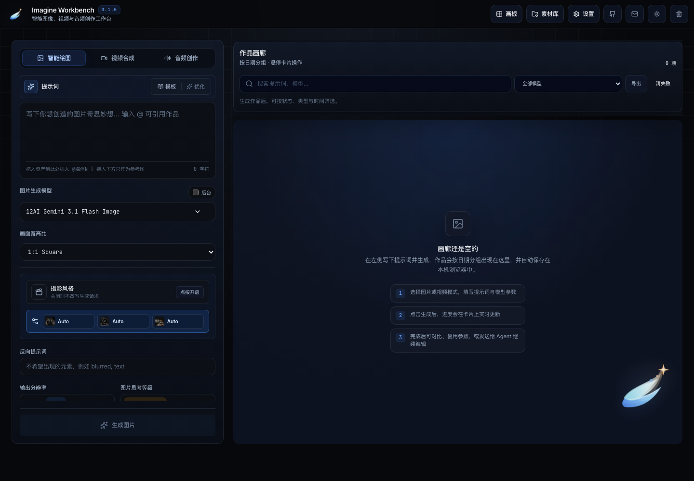

# Imagine Workbench

[English](README.md) | [简体中文](README.zh-CN.md)

Imagine Workbench 是一个浏览器优先的 AI 创意工作台，用于图像、视频、音频生成，以及由 Agent 辅助的视觉创意流程。

- **在线预览：** [imagine-workbench.pages.dev](https://imagine-workbench.pages.dev)
- **开源协议：** [AGPL-3.0-or-later](LICENSE.md)
- **作者：** [double2tea](https://github.com/double2tea) · <double_tea@foxmail.com>



## 功能亮点

- 通过提示词、参考图和蒙版编辑生成图像。
- 在所选模型支持时，通过文本、参考图或首尾帧生成视频。
- 支持 TTS、转写、声音设计、声音克隆，以及工作流驱动的音频目标。
- 使用 Agent Mode 规划创意动作，并触发推荐的生成步骤。
- 在 `/board` 画布中组织素材、笔记、参考图和生成节点。
- 生成素材默认存储在浏览器 IndexedDB，并提供 ZIP 备份与恢复工具。
- 通过供应商适配层接入 12AI、grok2api、xstx、Agnes AI、ModelScope、MiMo 和 RunningHub。
- 提供小型 OpenAI 兼容 `/v1/*` API，便于插件和脚本调用。

## 快速开始

环境要求：

- Node.js 24
- pnpm 10.27.0

```bash
corepack enable
corepack prepare pnpm@10.27.0 --activate
pnpm install --frozen-lockfile
cp .env.example .env.local
pnpm run dev
```

打开 Next.js 输出的本地地址，通常是 `http://localhost:3000`。

## 配置

供应商密钥可以写入 `.env.local`，也可以在应用内 Settings 面板中配置。

从 [.env.example](.env.example) 开始。常用变量如下：

```bash
TWELVE_AI_API_KEY="sk_your_12ai_key"
GROK2API_API_KEY="your_grok2api_key"
XSTX_API_KEY="sk_your_xstx_key"
AGNES_AI_API_KEY="your_agnes_ai_key"
MODELSCOPE_API_KEY="ms_your_modelscope_token"
RUNNINGHUB_API_KEY="your_runninghub_api_key"
MIMO_API_KEY="your_mimo_api_key"
```

如果部署到公共或团队环境，请设置 `OPENAI_COMPAT_API_KEY` 来保护面向插件的 `/v1/*` 路由。

更多说明见：[配置说明](docs/zh-CN/configuration.md)。

## 文档

| English | 简体中文 |
| --- | --- |
| [Configuration](docs/configuration.md) | [配置说明](docs/zh-CN/configuration.md) |
| [Provider and model guide](docs/providers.md) | [供应商与模型指南](docs/zh-CN/providers.md) |
| [OpenAI-compatible API](docs/openai-compatible-api.md) | [OpenAI 兼容 API](docs/zh-CN/openai-compatible-api.md) |
| [RunningHub API](docs/runninghub-api.md) | [RunningHub API](docs/zh-CN/runninghub-api.md) |
| [DaVinci Resolve Bridge](docs/resolve-bridge.md) | [DaVinci Resolve Bridge](docs/zh-CN/resolve-bridge.md) |
| [Development guide](docs/development.md) | [开发指南](docs/zh-CN/development.md) |
| [Security policy](SECURITY.md) | [安全策略](SECURITY.zh-CN.md) |
| [Contributing guide](CONTRIBUTING.md) | [贡献指南](CONTRIBUTING.zh-CN.md) |

## 常用命令

```bash
pnpm run dev
pnpm run lint
pnpm run typecheck
pnpm run check
pnpm run build
pnpm run pages:build
pnpm run test:providers
```

## 部署

仓库内置 Cloudflare Pages 工作流。推送到 `main` 后，在配置好下面的 GitHub secret 和 variable 时，会构建 Pages 输出并部署到 `imagine-workbench` Cloudflare Pages 项目：

- `CLOUDFLARE_API_TOKEN`
- `CLOUDFLARE_ACCOUNT_ID`

手动部署：

```bash
pnpm run pages:deploy
```

## 许可证

Imagine Workbench 使用 GNU Affero General Public License v3.0 or later。

允许个人、公司内部和商业使用。修改版本和衍生作品必须遵守 AGPL 条款；如果你分发它们，或将其作为网络服务提供，必须以相同许可证开放对应源代码，并清楚注明原作者和来源项目。
